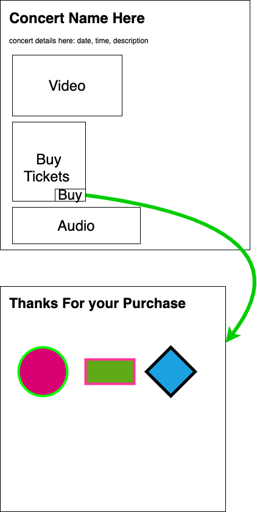

# Homework

Create a webpage for a concert/show event.  
The webpage must contain: title, headline with the concert name, a paragragh with the event details: short description, location, date, time, and price.  
A video, a form to buy tickets on the side, and an audio at the bottom.  
In the buy tickets form the user must enter: first name, last name, address, id number, credit card details (number, expiration, CVV), a checkbox with "I agree to terms" and a "buy" button.
You must use the semantic tags: header, main, section, aside, and footer.  
After buying a ticket, the form data must be sent to another page with the headline "Thanks For Your Purchase" and three colorfull shapes.
The webpage must have a favicon.

## Good Luck! 🙂
