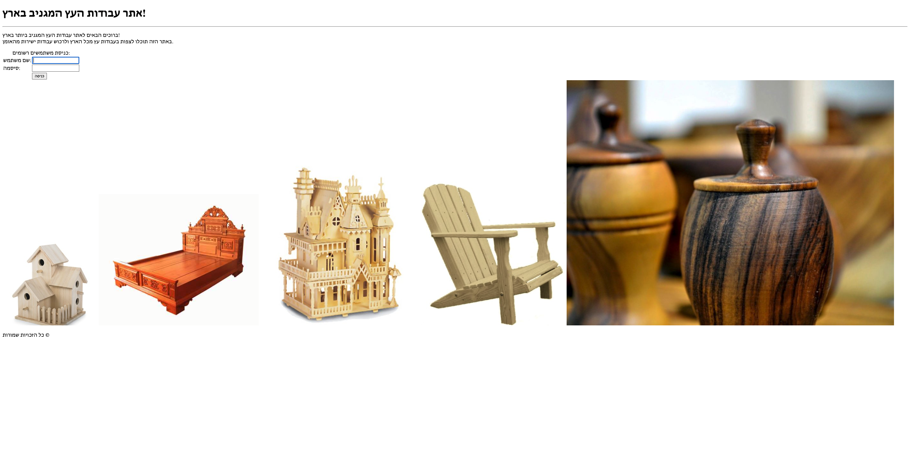
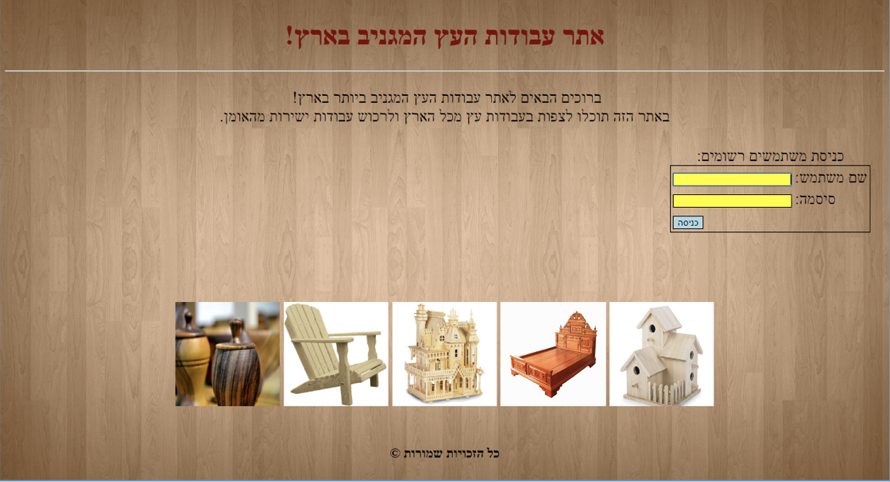
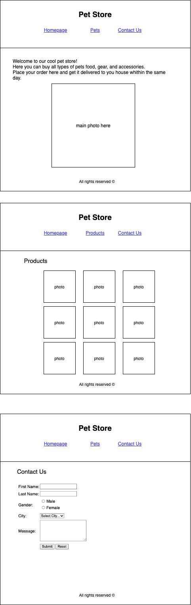

# Homework

## 1. Design Existing Webpage

Look at the following webpage:  
 

Add CSS designs to make it look like this:  
 

here is the existing webpage HTML:

```html
<!DOCTYPE html>
<html lang="he">
  <head>
    <meta charset="UTF-8" />
    <meta http-equiv="X-UA-Compatible" content="IE=edge" />
    <meta name="viewport" content="width=device-width, initial-scale=1.0" />
    <title>Document</title>
  </head>
  <body>
    <h1 class="header-text">אתר עבודות העץ המגניב בארץ!</h1>
    <hr />
    <p class="welcome-text">
      ברוכים הבאים לאתר עבודות העץ המגניב ביותר בארץ!<br />באתר הזה תוכלו לצפות בעבודות עץ מכל הארץ ולרכוש עבודות ישירות מהאומן.
    </p>
    <form>
      <table class="login-table">
        <caption>
          כניסת משתמשים רשומים:
        </caption>
        <tr>
          <td class="left">שם משתמש:</td>
          <td><input type="text" required autofocus /></td>
        </tr>
        <tr>
          <td class="left">סיסמה:</td>
          <td><input type="password" required /></td>
        </tr>
        <tr>
          <td></td>
          <td class="left">
            <input type="submit" value="כניסה" />                
          </td>
        </tr>
      </table>
    </form>
    <div id="img-container">
      
      
      
      
      
    </div>
    <p id="copyrights">כל הזכויות שמורות &copy;</p>
  </body>
</html>
```

## 2. Pet Store

Create a Pet Store website that looks like the illustration below.  
Make sure to align the labels and inputs in the "Contact us" form just like shown. (tip: use HTML `<table>`).  
Using CSS, make designs of your choice.  
The design must contain: font family, font color, background colors, links colors when hovered, and any other design you like.  
 
