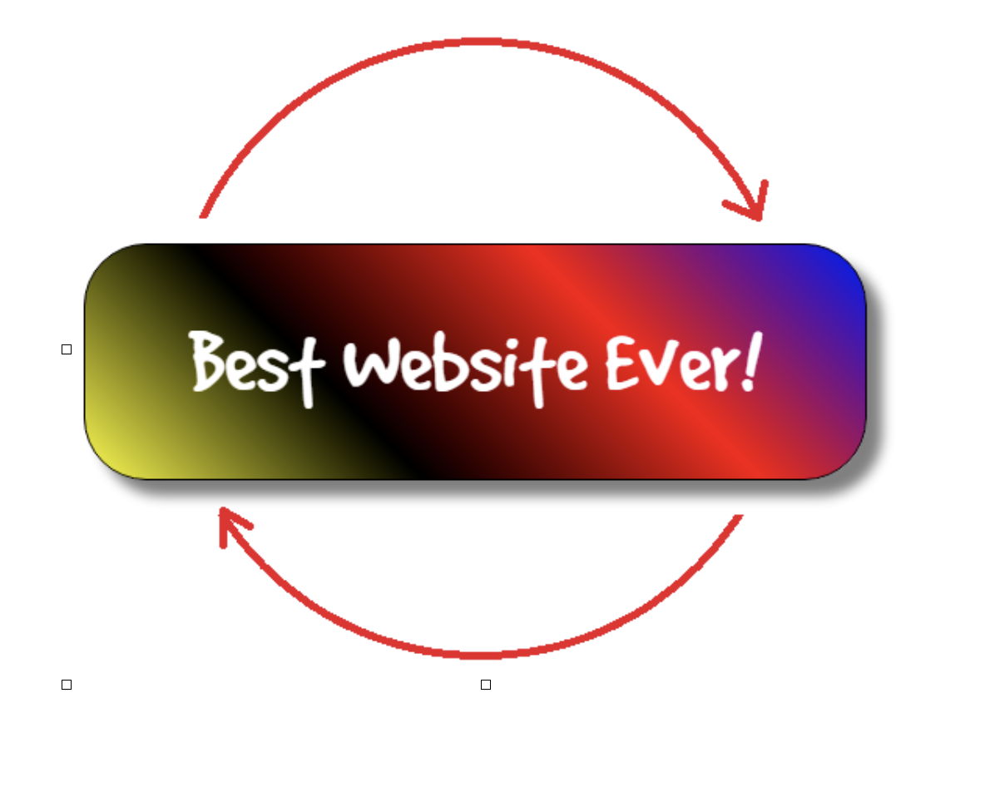

# Homework

## 1. Webpage 
Create a webpage that contains the following:
* background for the whole webpage with gradient colors
* custom font that you downloaded from the internet
* when hovering the headline, change its color to a different one
* an image with rounded corners
* a paragraph with text shadow
* a table with 3 columns and 10 rows (with the content of your choice) with the following:  
  - every even row has a gray background color
  - every odd row has a gray font color
* a banner that always sticks to the bottom left corner of the webpage, even when scrolling 

## 2. Pet Store
add styles (with your personal taste) to the Pet Store website from the previous homework.  
The styles must contain:
* colors gradient
* custom font
* shadowing
* rounded corners
* some animation

## 3. Fancy message with animation
Create a webpage with a div that looks like the one below.  
(it has gradient colors, custom font, shadow, rounded corners)  
Add animation to make the div rotate non-stop in slow rounds in the arrows direction
 