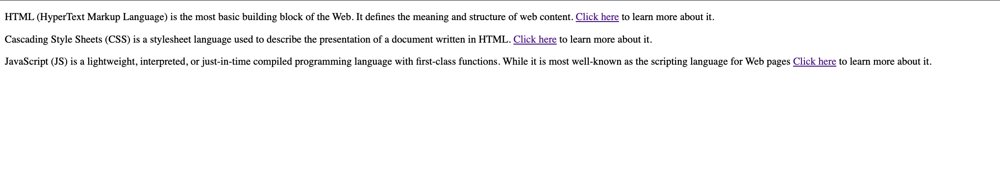
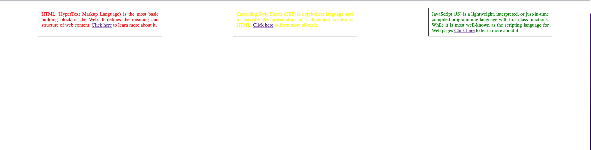
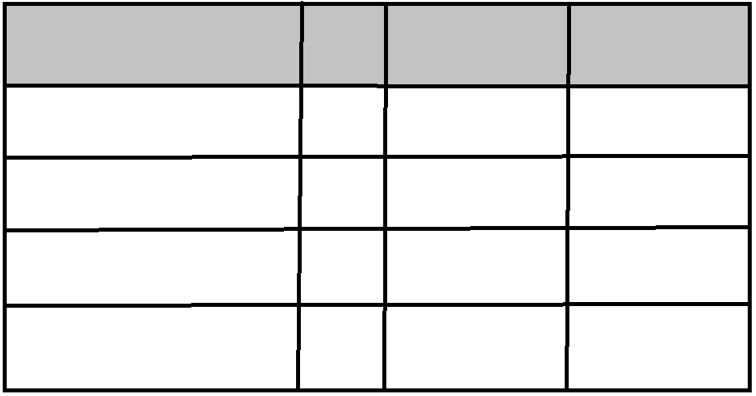
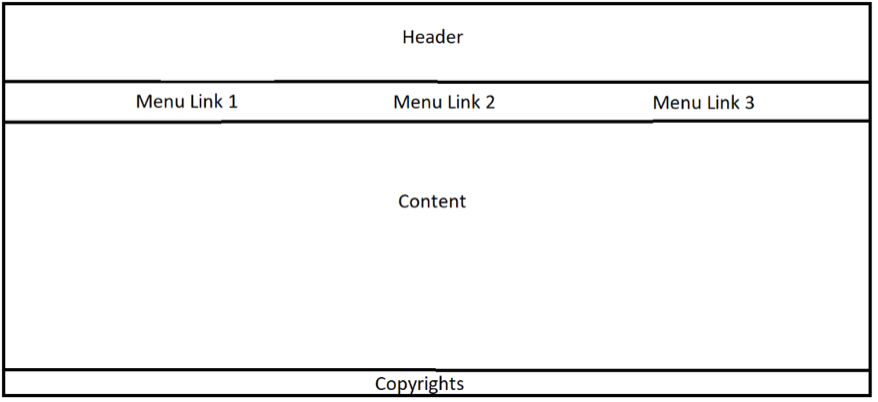
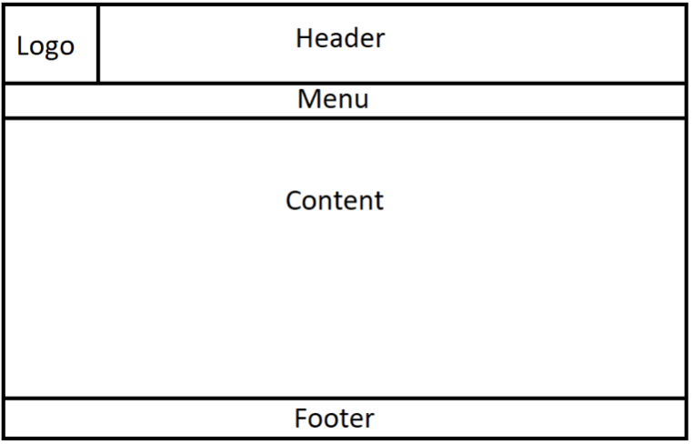
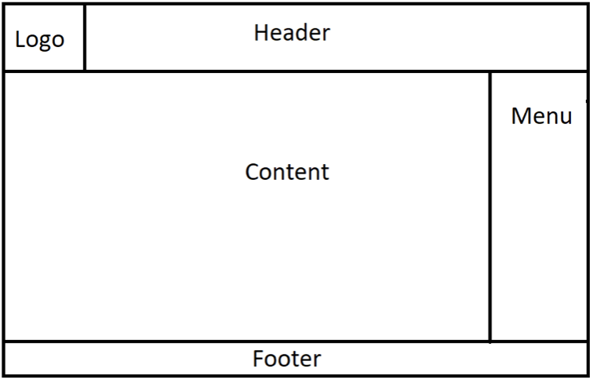

# Homework

## Flex

Here is a webpage and its HTML:  


```html
<!DOCTYPE html>
<html lang="en">
  <head>
    <meta charset="UTF-8" />
    <meta http-equiv="X-UA-Compatible" content="IE=edge" />
    <meta name="viewport" content="width=device-width, initial-scale=1.0" />
    <title>Homework - Flex</title>
  </head>
  <body>
    <div class="container">
      <p>
        HTML (HyperText Markup Language) is the most basic building block of the
        Web. It defines the meaning and structure of web content.
        <a href="https://www.w3schools.com/html">Click here</a> to learn more
        about it.
      </p>
      <p>
        Cascading Style Sheets (CSS) is a stylesheet language used to describe
        the presentation of a document written in HTML.
        <a href="https://www.w3schools.com/css">Click here</a> to learn more
        about it.
      </p>
      <p>
        JavaScript (JS) is a lightweight, interpreted, or just-in-time compiled
        programming language with first-class functions. While it is most
        well-known as the scripting language for Web pages
        <a href="https://www.w3schools.com/js">Click here</a> to learn more
        about it.
      </p>
    </div>
  </body>
</html>
```

Add CSS to make it look like this: (**without changing the HTML**)


## Grid

1. Use grid to create this table:  
   

2. Use grid to create this layout:  
   

3. Use grid to create this layout (Logo should be a cell in the grid):  
   

4. Use grid to create this layout (The Header and Logo should be placed using flex):  
   
