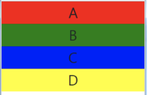
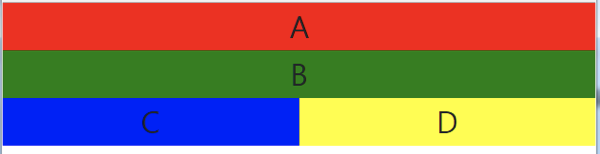
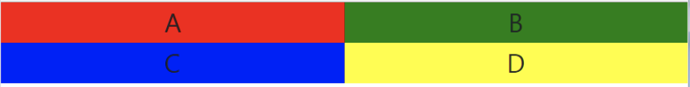
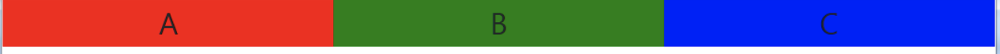
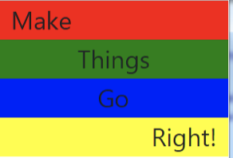
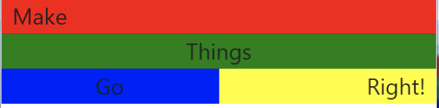
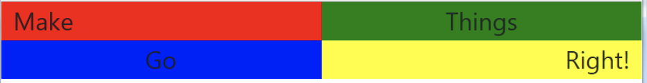
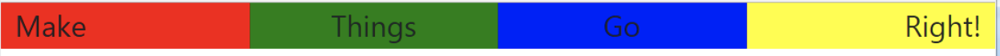
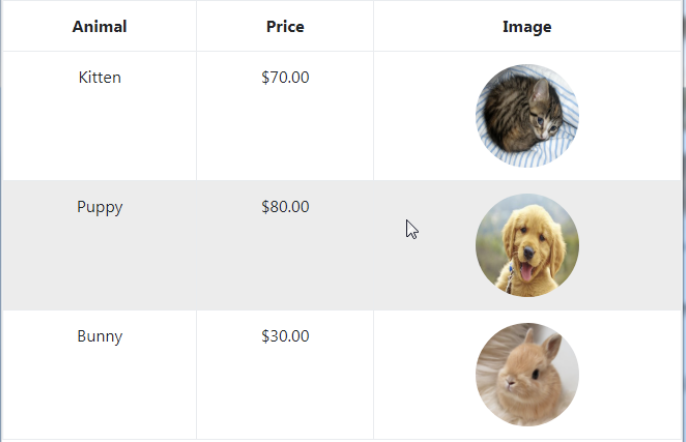

# Homework

## 1. Bootstarp Grid System

Create a webpage with the following layout:

- Extra Small viewport  
  

- Small viewport  
  

- Medium viewport  
  

- Large viewport and above  
  

## 2. Bootstarp CSS - Typography

Change the webpage from 1. to look like:

- Extra Small viewport  
  

- Small viewport  
  

- Medium viewport  
  

- Large viewport and above  
  

## 3. Bootstrap CSS - Table

Create a webpage with table that will look like:  
   
\*\* there should be a hover effect just like shown

## 4. Bootstrap Components - Cards

Create a webpage containing 5 [Cards](https://getbootstrap.com/docs/5.1/components/card/#example).  
Each card should contain: image, title, and description.  
You can choose any topic like, for example - food: 5 pictures of food with name and description.

## 5. Bootstrap Components - Collapse

Create a webpage containing 3 [Collapses](https://getbootstrap.com/docs/5.1/components/collapse/).  
Each one should have a TV show name on the button. When clicked, the TV show image and description should be revealed.

## 5. Bootstrap Components - Carousel

Create a webpage with 5 images inside a [Carousel](https://getbootstrap.com/docs/5.1/components/carousel/).  
Make sure to include [controls](https://getbootstrap.com/docs/5.1/components/carousel/#with-controls) and [indicators](https://getbootstrap.com/docs/5.1/components/carousel/#with-indicators).

## 6. Resume Webpage

Create a webpage with your resume.  
The webpage should contain your profile image, personal details, technologies you know (HTML, CSS, Bootstrap ...), and contact details.  
Make your webpage as impressive as you can using Bootstrap.
