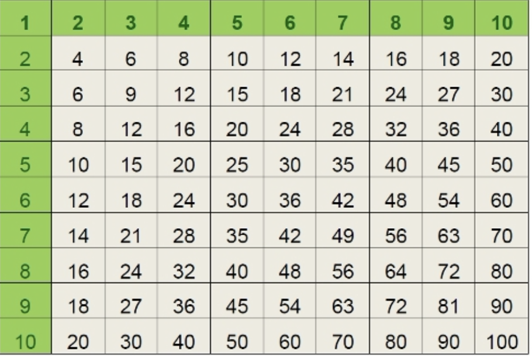

# Homework

## Create JavaScript for the following tasks:

1. Get Two integer numbers from the user.  
   Display one random integer number between the two numbers you get from the user.  
   For example, the user enters: `10`, `20` - display a random number between `1` and `20` (inclusive).

2. Get Two integer numbers from the user.  
   Display 100 random integer numbers between the two numbers you get from the user.  
   For example, the user enters: `10`, `20` - display 100 random integer numbers between `1` and `20` (inclusive).

3. Get Two integer numbers from the user.  
   Create an array and fill it with 100 random integer numbers between the two numbers you get from the user.  
   For example, the user enters: `10`, `20` - fill an array with 100 integer numbers between `1` and `20` (inclusive).  
   Display the array, display the average number in the array.  
   Make sure the average number makes sense - for example, in the above example the average should be around `15`.

4. Create an array.  
   Fill the array with 100 random integer numbers between `300` and `500` (inclusive).  
   Then do the following:

- using "for" loop, display the sum of numbers in the array.
- using "for-of" loop, display the sum of numbers in the array, make sure it equals the previous sum.
- using "for" loop, display the maximum number in the array.
- using "for-of" loop, display the maximum number in the array, make sure it equals the previous maximum.
- using "for" loop, display how many even numbers are in the array.
- using "for-of" loop, display how many even numbers are in the array, make sure it equals the previous.

5. Create three objects that describe cars.  
   A car has the following properties: `maker`, `model`, and `color`.  
   Push the three cars into an array.  
   Loop over the array and display each car property in a separate line.  
   Loop over the array and display each car property in a separate line, this time using an internal "for-in" loop.

6. Create an array filled with five objects that describe dogs.
   Do not push the dogs into the array! instead, **initialized** array:

```js
[{...}, {...}, {...}...]
```

A dog has the following properties: `name`, `age`, `breed`, and `color`.  
Using a nested loop, display all properties of all dogs in the array.

7. Create an array.  
   Fill the array with 3 Geolocation objects you get from the user.  
   a Geolocation object has the following properties: `longitude` and `latitude`.  
   Display all.

8. Here is a Matrix:

```js
var matrix = [
  [12, 23, 34, 45],
  [56, 67, 78, 89],
  [10, 20, 30, 40],
];
```

Display:

- the matrix (2 dimensional).
- the sum of all numbers.
- the average number.
- the maximum number.
- the minimum number.
- the matrix (2 dimensional), but only the even numbers. Instead of the odd numbers, display `X`.

9. Create a Matrix named `multiplicationBoard`.  
   Using a nested loop, fill the Matrix with values and display it.  
   Multiplacation Board:  
   

10. **Challange** - A Prime number is a number that can be divided only by `1` and itself **without a reminder**.  
    For example, `7` is a Prime number because it can only be divided by `1` or by `7` without a reminder.  
    `9` is not a Prime number because it can be divided by `3`.  
    `10` is not a Prime number because it can be divided by `2`.  
    Get one number from the user. Display if it is a Prime number or not.

11. **Challange** - Get two numbers from the user: `start`, `end`.  
    Create an array and fill it with all prime numbers between `start`, `end`.  
    Display the array.
