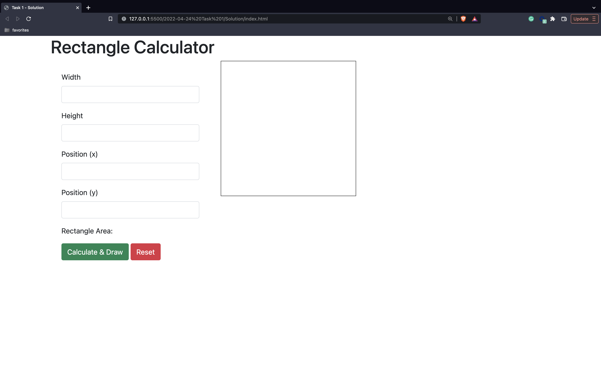
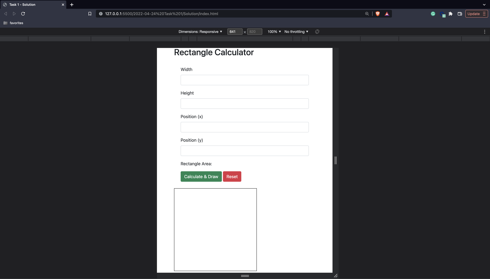

# Task 1

## General Instructions

1. Make sure to write clean and efficient code. "Spaghetti Code" is bad! divide your JS code into functions.
2. You can use any material you want from the internet or past examples and class exercises.
3. Do your work alone. Do not talk to or consult anyone from the class or outside.
4. Treat the task as a job interview.
5. After you send the task to get a score, do not change it!!

## What you are going to build?

A webpage - "Rectangle Calculator".  
The webpage contains a form with 4 inputs and 2 buttons and a canvas.

## Inputs

- width - The rectangle's width.
- height - The rectangle's height.
- x - The x-axis coordinate of the rectangle's starting point.
- y - The y-axis coordinate of the rectangle's starting point.  
  All inputs are mandatory and must be a positive integer number between `1` and `300` (inclusive).

## Buttons

- Calculate & Draw.
- Reset.

## Canvas

- An HTML canvas with a size of `300` X `300` pixels, with a border.

Using Bootstrap, design the webpage elements and layout as shown in the following image:  

 
On small screens (less than `768` pixels) the layout should be as follows:  

When the user clicks on the "Calculate & Draw" button, if the values are valid, calculate and display the rectangle area inside a span at the button (right after "Rectangle Area:"), and draw a filled blue rectangle in the canvas with `width` and `height` dimensions and `x` and `y` position.  
If the values are not valid - the rectangle will overflow outside the canvas borders, display an alert "Invalid values!".

When the user clicks on the "Reset" button, all inputs, rectangle area, and canvas should be cleared.

Create a Github public repository and push your code there.

## Bonus

- After the rectangle is drawn, the values are stored in `localStorage` so the next time the user visits the webpage - the values appear inside the inputs, the area is calculated and the rectangle is drawn again.  
  When the user clicks on "Reset" - clear the `localStorage` as well.
- Use "Github Pages" to deploy the website.

## Scoring

- For a functioning form and area calculation - `40` points.
- For a functioning canvas - `20` points.
- For a style and responsive layout just like in the images - `10` points.
- For clean and efficient code - `30` points.
- For the bonus - `15` points.

## How to send the task and get a score?

Send guy@barsheshet.com an email with a link to the repository.  
Do not perform any changes to the repository after you send the email.
