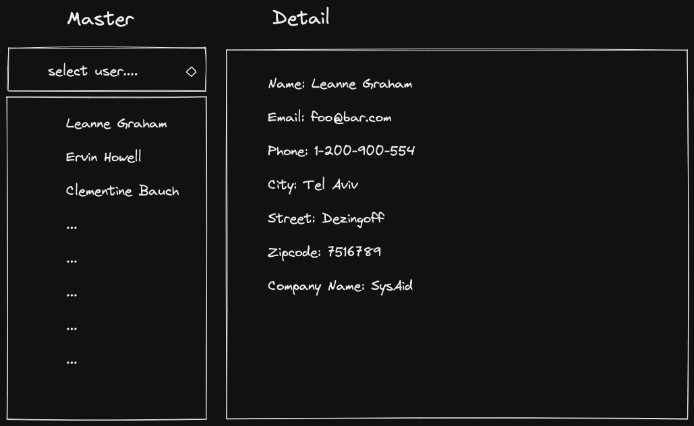
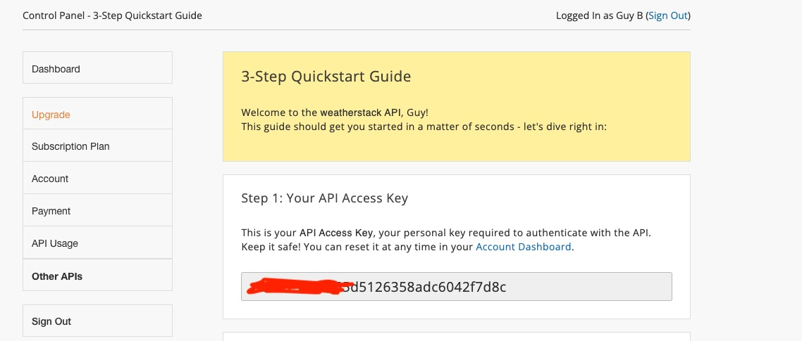

# Homework

## Write a solution for each one of the following tasks using `XMLHttpRequest` first, and then convert it to use `fetch`

1. Create a webpage that when loads get the list of users from https://jsonplaceholder.typicode.com/users  
   Display the list of users in a table.  
   For each user display name, username, email, phone, city, street, zip code, and company name.

2. Create a webpage with an input of type number and a button with the text "Get User".  
   When the user enters a number clicks on the button, get a single user from this URL: https://jsonplaceholder.typicode.com/users/{id} (replace the `{id}` with the number from the input).  
   For example, when the user enters `5`, the URL for getting a single user should be https://jsonplaceholder.typicode.com/users/5.  
   Display the user's name, username, email, phone, city, street, zip code, and company name in an esthetic way on the page.

3. Master-Details view is a design concept in web applications.  
   In this design, there is a list of items on the left and when the user selects a single item, the item details are shown to the right.  
   Every time the user changes his selection, the details area updates accordingly.  
   Create a webpage with select input. When the page loads, get the list of users from this https://jsonplaceholder.typicode.com/users and fill the select input with the user's id and name.  
   For Example, after the page loads and you get the list of users, the select should look something like this:

```html
<select>
  <option value="1">Leanne Graham</option>
  <option value="2">Ervin Howell</option>
  <option value="3">Clementine Bauch</option>
  ...
</select>
```

When the user selects one user for the list, use https://jsonplaceholder.typicode.com/users/{id} (replace the `{id}`) to get a single user data.  
 Display the single user details on the right side of the webpage.  
 If the user changes his selection, get the new user's data from the server and update the details.  
 The webpage should look something like this:  
 

4. Create a webpage with the button "Get Pictures".  
   When the user clicks on the button, get a list of pictures from this URL: https://jsonplaceholder.typicode.com/photos.  
   Display a table with the first 100 photos from the list.  
   For each photo display albumId, id, title, and the image itself (the image URL is in the thumbnailUrl field).

5. The website https://www.apixu.com allows you to get weather data worldwide for free.  
   Register to this site (Free Plan), after you register, you'll get an API Access Key.  
      
    Create a Master-Details webpage with select input that shows a list of cities.  
    When the user selects a city, get the weather data of that city from this URL: http://api.weatherstack.com/current?access_key={YOUR_ACCESS_KEY}&query={SOME_CITY} (replace `{YOUR_ACCESS_KEY}` and `{SOME_CITY}`).  
    For example, if the user selects Tel Aviv, then the URL would be (not real API Key): http://api.weatherstack.com/current?access_key=2e294349911204091811&query=Tel-Aviv.  
    Near the weather data, you should also display the icon that represents the weather (returned as part of the weather data JSON).
   \*\* Important - please note the URL is with `http` not `https`
