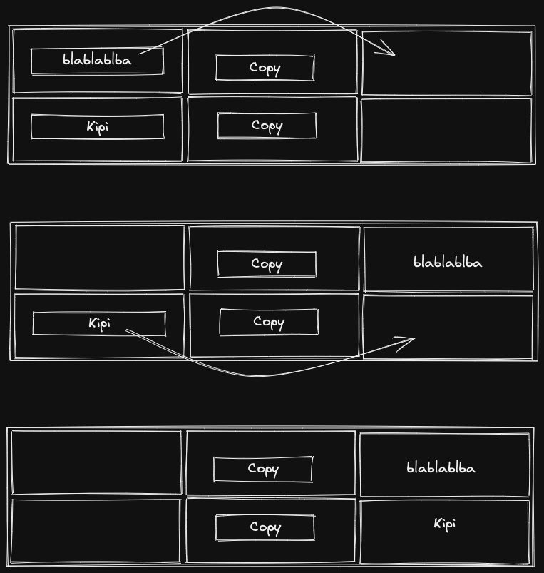
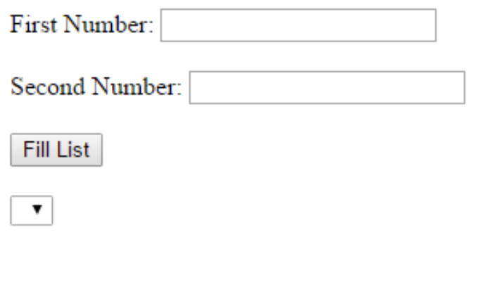
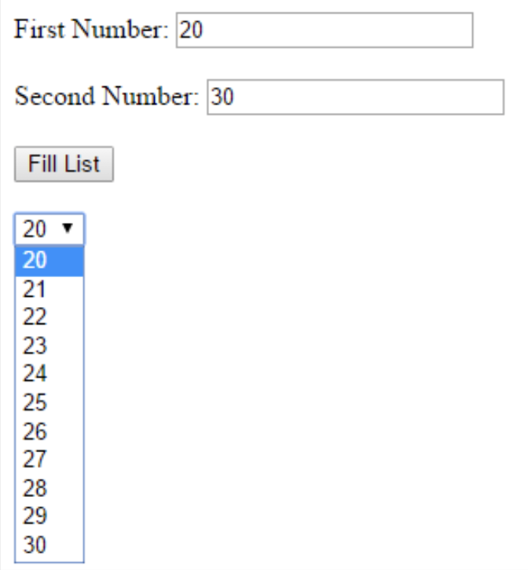
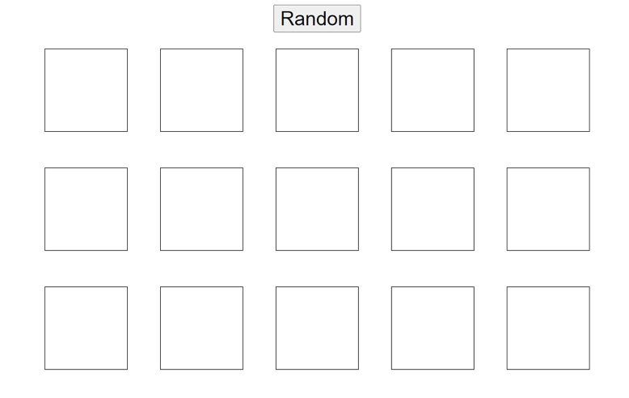
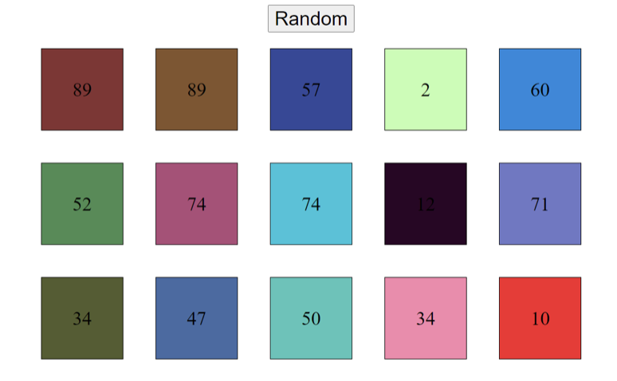
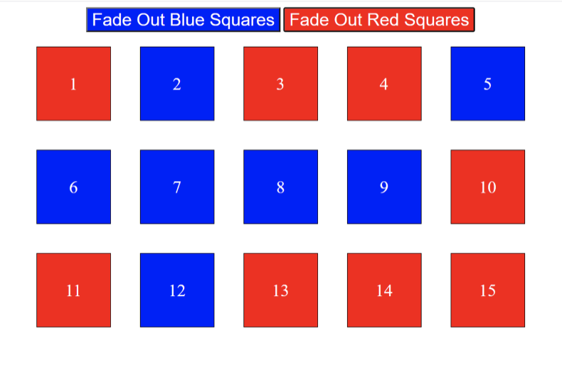
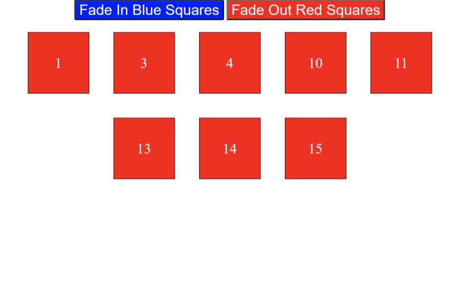
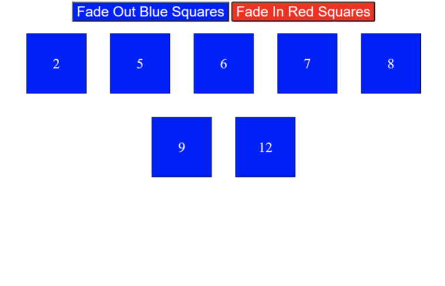

# Homework

## Use jQuery for the following tasks

1. jQuery Functions - Create a webpage with a table with 2 rows and 2 columns.  
    Each row as one cell with an input, one cell with a "Copy" button, and one empty cell.  
    When the user clicks on the "Copy" button, the text from the input appears inside the empty cell, and the input disapears.
   

2. jQuery DOM - Create this webpage:  
     
   When the user clicks on the "Fill" button, The select input is is filled with numbers between "First Number" and "Second Number" like this:  
   

3. jQuery Each - Create this webpage with a button and 15 empty divs:  
     
   When the user clicks on the "Random" button, each div gets a random number and a random background color.
   For example  
   

4. jQuery Animations - Create this webpage with 2 buttons and 15 divs:  
     
   When the user clicks on the blue button, all the blue divs disappear with a 2 seconds fade-out effect, and the text inside the blue button changes accordingly  
     
   When the user clicks on the blue button again, the blue divs should apprear again with a 2 seconds fade-in effect, and the text inside the blue button changes accordingly  
     
   Same thing when the user clicks on the red button - the red divs disapper with fade-out effect  
     
   And Appears again when the user clicks on the button again.  
   
