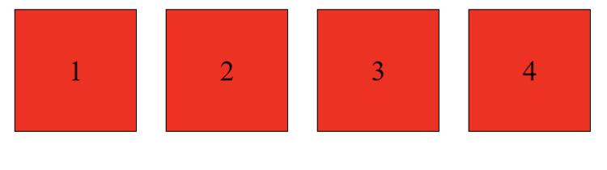

# Class Exercise

1. Create this webpage:  
     
   Using jQuery, when the mouse cursor enters a div, change its background color to blue and the font color to white.  
   When the mouse cursor is getting out of a div, change its background color back to red and the font color to black.

2. Continue the task above - Add a button, when the user clicks on the button, add a new div.  
   Please note that the mouse events should also work on the new divs added.

3. Create a webpage with a button.  
   When the user clicks on the button, make a jQuery AJAX call to this URL: https://api.chucknorris.io/jokes/random  
   to get a random Chuck Norris joke, and display it on the screen.
