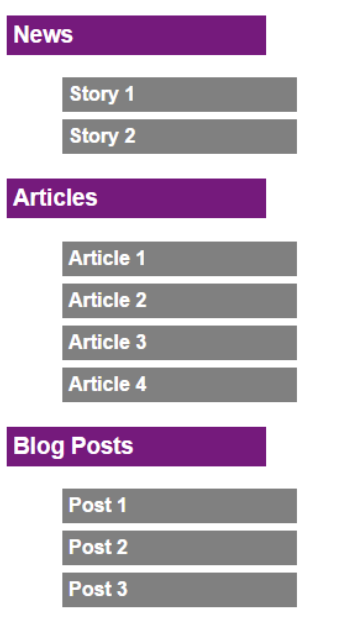
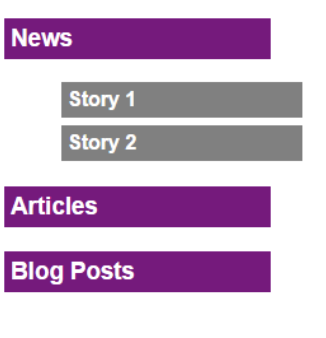
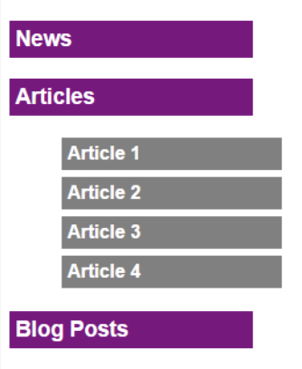
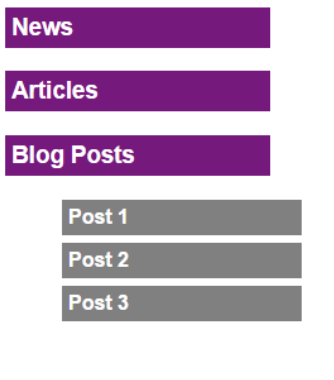

# Homework

1. Continue task No. 4 from [last homework](https://github.com/barsheshet/jbc-2022-01-30-fullstack/tree/main/2022-05-29%20jQuery/Homework) -  
   Change the HTML only to contain the two buttons and a section:

```html
<body>
  <button id="blueButton">Fade Out Blue Squares</button>
    <button id="redButton">Fade Out Red Squares</button>   
  <section id="container"></section>
</body>
```

This means now the 15 divs will be added to the HTML dynamically on-page lead.  
Each div should be numbered and have random color (red or blue).  
Everything should work exactly the same as the last task when the user clicks on the red and blue buttons.  
Also, please add the following:

- when the user clicks on a div, display an alert with the div number.
- when the mouse cursor enters a div, its border should be thicker and its font should be bold.
- When the mouse cursor leaves the div, its border and font should get back to normal.

2. Use jQuery AJAX to re-write your solution to task No. 4 here [weather task](https://github.com/barsheshet/jbc-2022-01-30-fullstack/tree/main/2022-05-22%20Advanced%20JavaScript/Homework)

3. Here is a piece of HTML and CSS for a webpage with a menu:  
   

```html
<div id="menu">
  <h3>News</h3>
  <ul>
    <li><a href="#">Story 1</a></li>
    <li><a href="#">Story 2</a></li>
  </ul>
  <h3>Articles</h3>
  <ul>
    <li><a href="#">Article 1</a></li>
    <li><a href="#">Article 2</a></li>
    <li><a href="#">Article 3</a></li>
    <li><a href="#">Article 4</a></li>
  </ul>
  <h3>Blog Posts</h3>
  <ul>
    <li><a href="#">Post 1</a></li>
    <li><a href="#">Post 2</a></li>
    <li><a href="#">Post 3</a></li>
  </ul>
</div>
```

```css
body { font-family: Arial; }
#menu > h3 {
  width: 200px;
  background-color: purple;
  color: White;
  font-weight: bold;
  padding: 5px;
}
#menu > ul { width: 200px; }
#menu > ul > li { list-style-type: none; }
a {
  display: block;
  background-color: gray;
  color: White;
  padding: 5px;
  border-bottom: 1px solid white;
  text-decoration: none;
  font-weight: bold;
  margin: 5px;
}
a:hover {
  background: lime;
  text-decoration: underline;
}
```

Using jQuery, make this menu to an "Accordion" menu -  
When the page load, all sub-items must be hidden:  
  
When the mouse enters one of the menu items, the sub-items must be expanded downwards, and all the rest sub-items must collapse upwards.  
  
  

